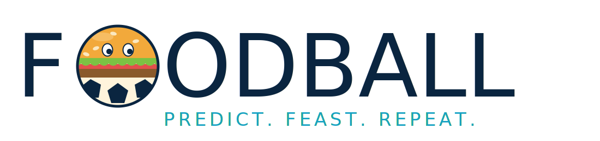

<p align="center">
  
</p>

<p align="center"><strong>Predict. Feast. Repeat.</strong> · <em>Champion eats free.</em> 🍔⚽</p>

<p align="center">
  <a href="#license"></a>
</p>

---

**FoodBall** is a $0-infrastructure, mobile-first PWA prediction league for an
office (~20–50 colleagues) to play the **FIFA World Cup 2026**. Predict match
outcomes, earn **points** (never money — this is *not* gambling), climb **The Food
Chain**, and the winner eats free. ~6 weeks of fun, then archive.

> Built milestone by milestone from [`plans/worldcup-league-claude-code-prompt.md`](plans/worldcup-league-claude-code-prompt.md).
> **All milestones (M1–M5) are built and verified**, and it's been run live on the
> real World Cup 2026 (48 teams, 72 group-stage fixtures from openfootball).

## What's inside

- **Three prediction tiers** — per-match markets (W/D/W, exact score, BTTS, over/under,
  with an **underdog ×2** on outcomes), per-round props (Top Chef / Clean Plate / Spice),
  and revisable tournament long-shots whose value **decays** the later you set them.
- **Server-authoritative scoring & pick-locking** — all in Postgres; the client never
  computes points, and the DB rejects a pick after kickoff even if the UI is bypassed.
  Row-level security keeps your picks private until kickoff, then opens them to everyone
  (so the stadium and the Food Chain expand can show who backed whom — no copying).
- **Live everything** — a Realtime leaderboard (**The Food Chain**) with rank-change
  arrows where you can **tap any chef to expand their per-match predictions** (the team
  they backed, side markets, points — others' picks stay hidden until kickoff), live
  scores, result-moment celebration overlays, an animated **Match Day** stadium (avatars
  in team kits on their picked side, cheering/crying on goals) with a live match clock,
  and a live commentary feed. Token-free **auto-live** (matches go live at kickoff) +
  **auto-settle** (finished matches settle themselves from openfootball), with admin
  entry as the instant, authoritative override. Match picks **lock strictly at kickoff**;
  any prediction set after a match started is voided and shown on a **Red Cards** page.
- **The fun layer** — DiceBear avatars, an installable PWA, a first-run "How to play"
  guide (+ a Remotion animated guide), and an optional Remotion **recap** video.
- **$0 infra** — Vite + React 18 + TypeScript (strict) + Tailwind on the front; Supabase
  free tier (Postgres + Auth + RLS + Realtime + Edge Functions + `pg_cron`) on the back.
  Auth is **email + password** (no SMTP dependency).

See [`CLAUDE.md`](CLAUDE.md) for the architecture + the conventions that keep the pun
intact, and [`session_status.md`](session_status.md) for the current run/verify snapshot.

## Quickstart (hardened local Docker)

```bash
openssl rand -base64 32 | tr -d '\n' > secrets/db_password.txt && chmod 600 secrets/db_password.txt
docker compose -p foodball up -d --build      # → http://127.0.0.1:8090
```

Run the server-side acceptance tests (prove scoring/locking):

```bash
docker compose -p foodball exec -T db sh -c \
  'PGPASSWORD=$(cat /run/secrets/db_password) psql -U foodball -d foodball -v ON_ERROR_STOP=1 -f /tests/core_loop_test.sql'
```

Dev server + the Supabase CLI path for real browser auth →
[`docs/RUNNING.md`](docs/RUNNING.md). Security control mapping (CIS / NIST / SOC 2)
→ [`docs/SECURITY.md`](docs/SECURITY.md).

## Deploy your own (run it for your office)

It's designed to be self-hosted on free tiers — each deployment is **independent**
(its own database, its own players' data; forking this repo gives you the code, never
anyone else's data). High level:

1. **Backend** — create a free [Supabase](https://supabase.com) project (or self-host
   the Supabase CLI stack), then apply everything in `supabase/migrations/` and
   `supabase/seed.sql`. (The migrations are plain numbered SQL; `supabase db push`
   or `psql -f` both work.)
2. **Secrets** — copy `.env.example` → `.env.local` and fill in **your** Supabase
   project URL + anon key. The service-role key and any `football-data.org` token are
   **Supabase secrets**, never put in the frontend. Nothing secret is committed here —
   `.gitignore` keeps `.env*` and `secrets/` out of git.
3. **Frontend** — `npm install && npm run build`, then host the static build anywhere
   (Vercel / Netlify free tiers, or behind nginx like the reference deploy).
4. **Fixtures & results** — import fixtures (openfootball is keyless and free; see
   `scripts/import-real-fixtures.mjs`). Matches go live at kickoff and self-settle from
   openfootball once it publishes a final, both token-free — or enter results in the
   Admin screen (instant; fires commentary + overlays + scoring; always wins). An
   optional `football-data.org` token can add faster scores (free tier may not cover WC2026).
5. **Before sharing** — make yourself admin, then set the **signup email-domain
   allowlist** (Admin → Launch tools → "Who can sign up") so only your colleagues can
   register. It's enforced server-side and ships seeded with one domain.

Full self-host runbook (single origin behind nginx + Let's Encrypt) →
[`docs/DEPLOYMENT.md`](docs/DEPLOYMENT.md).

## Stack

Vite · React 18 · TypeScript (strict) · Tailwind · `framer-motion` · DiceBear · Supabase
(Postgres + Auth + RLS + Realtime + Edge Functions + `pg_cron`) · Remotion (optional
recap, separate `/recap` package). The approved dependency allow-list is in
[`CLAUDE.md`](CLAUDE.md).

## License

[MIT](LICENSE) © 2026 Tawfiqul Bari — use it, fork it, run it for your own office.
It's provided as-is, with no warranty. *(FoodBall is a points-only game; it is **not**
gambling — no money, wallets, odds, or payouts.)*
